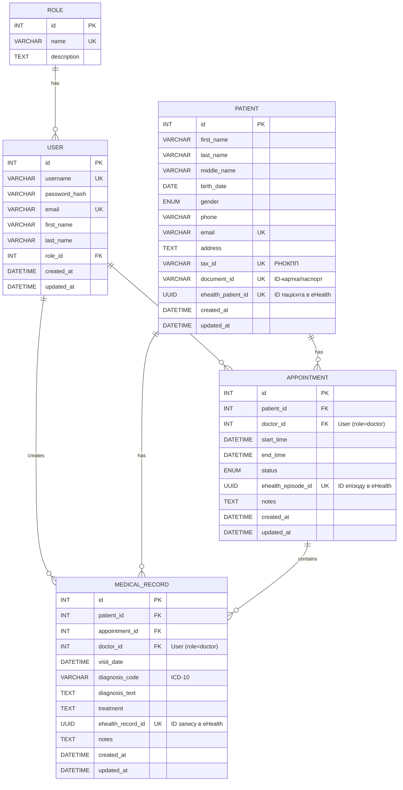

# ER-діаграма основних сутностей

> **Примітка:** Ця діаграма є базовим проєктом. Вона буде розширена та деталізована відповідно до вимог Національної служби здоров'я України (НСЗУ) та стандартів електронної системи охорони здоров'я (eHealth), включаючи специфічні ідентифікатори, довідники та обов'язкові поля.

## 1. Сутності та їх атрибути

### User (Користувач)
-   `id` (PK, INT)
-   `username` (VARCHAR)
-   `password_hash` (VARCHAR)
-   `email` (VARCHAR, UNIQUE)
-   `first_name` (VARCHAR)
-   `last_name` (VARCHAR)
-   `role_id` (FK, INT)
-   `created_at` (DATETIME)
-   `updated_at` (DATETIME)

### Role (Роль)
-   `id` (PK, INT)
-   `name` (VARCHAR, UNIQUE) (e.g., 'admin', 'doctor', 'registrar')
-   `description` (TEXT)

### Patient (Пацієнт)
-   `id` (PK, INT)
-   `first_name` (VARCHAR)
-   `last_name` (VARCHAR)
-   `middle_name` (VARCHAR, NULLABLE)
-   `birth_date` (DATE)
-   `gender` (ENUM('male', 'female', 'other'))
-   `phone` (VARCHAR)
-   `email` (VARCHAR, UNIQUE, NULLABLE)
-   `address` (TEXT, NULLABLE)
-   `tax_id` (VARCHAR, UNIQUE, NULLABLE) - РНОКПП
-   `document_id` (VARCHAR, UNIQUE, NULLABLE) - ID-картка/паспорт
-   `ehealth_patient_id` (UUID, UNIQUE, NULLABLE) - Ідентифікатор пацієнта в eHealth
-   `created_at` (DATETIME)
-   `updated_at` (DATETIME)

### Appointment (Прийом/Епізод)
-   `id` (PK, INT)
-   `patient_id` (FK, INT)
-   `doctor_id` (FK, INT) (FK до User, де role_id = doctor)
-   `start_time` (DATETIME)
-   `end_time` (DATETIME)
-   `status` (ENUM('scheduled', 'completed', 'cancelled', 'no-show'))
-   `ehealth_episode_id` (UUID, UNIQUE, NULLABLE) - Ідентифікатор епізоду в eHealth
-   `notes` (TEXT, NULLABLE)
-   `created_at` (DATETIME)
-   `updated_at` (DATETIME)

### MedicalRecord (Медичний запис)
-   `id` (PK, INT)
-   `patient_id` (FK, INT)
-   `appointment_id` (FK, INT)
-   `doctor_id` (FK, INT) (FK до User, де role_id = doctor)
-   `visit_date` (DATETIME)
-   `diagnosis_code` (VARCHAR) - Код за ICD-10
-   `diagnosis_text` (TEXT)
-   `treatment` (TEXT)
-   `ehealth_record_id` (UUID, UNIQUE, NULLABLE) - Ідентифікатор запису в eHealth
-   `notes` (TEXT, NULLABLE)
-   `created_at` (DATETIME)
-   `updated_at` (DATETIME)

## 2. Взаємозв'язки (Relationships)

