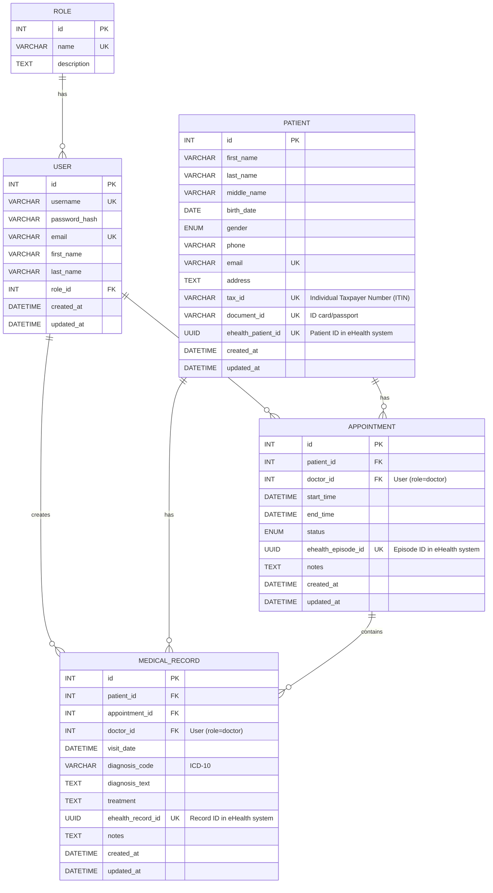

# ER Diagram of Main Entities

> **Note:** This diagram is a basic design. It will be expanded and detailed according to the requirements of the National Health Service of Ukraine (NSZU) and eHealth electronic healthcare system standards, including specific identifiers, directories, and mandatory fields.

## 1. Entities and Their Attributes

### User
-   `id` (PK, INT)
-   `username` (VARCHAR)
-   `password_hash` (VARCHAR)
-   `email` (VARCHAR, UNIQUE)
-   `first_name` (VARCHAR)
-   `last_name` (VARCHAR)
-   `role_id` (FK, INT)
-   `created_at` (DATETIME)
-   `updated_at` (DATETIME)

### Role
-   `id` (PK, INT)
-   `name` (VARCHAR, UNIQUE) (e.g., 'admin', 'doctor', 'registrar')
-   `description` (TEXT)

### Patient
-   `id` (PK, INT)
-   `first_name` (VARCHAR)
-   `last_name` (VARCHAR)
-   `middle_name` (VARCHAR, NULLABLE)
-   `birth_date` (DATE)
-   `gender` (ENUM('male', 'female', 'other'))
-   `phone` (VARCHAR)
-   `email` (VARCHAR, UNIQUE, NULLABLE)
-   `address` (TEXT, NULLABLE)
-   `tax_id` (VARCHAR, UNIQUE, NULLABLE) - RNOKPP
-   `document_id` (VARCHAR, UNIQUE, NULLABLE) - ID card/passport
-   `ehealth_patient_id` (UUID, UNIQUE, NULLABLE) - Patient identifier in eHealth
-   `created_at` (DATETIME)
-   `updated_at` (DATETIME)

### Appointment (Appointment/Episode)
-   `id` (PK, INT)
-   `patient_id` (FK, INT)
-   `doctor_id` (FK, INT) (FK to User, where role_id = doctor)
-   `start_time` (DATETIME)
-   `end_time` (DATETIME)
-   `status` (ENUM('scheduled', 'completed', 'cancelled', 'no-show'))
-   `ehealth_episode_id` (UUID, UNIQUE, NULLABLE) - Episode identifier in eHealth
-   `notes` (TEXT, NULLABLE)
-   `created_at` (DATETIME)
-   `updated_at` (DATETIME)

### MedicalRecord (Medical Record)
-   `id` (PK, INT)
-   `patient_id` (FK, INT)
-   `appointment_id` (FK, INT)
-   `doctor_id` (FK, INT) (FK to User, where role_id = doctor)
-   `visit_date` (DATETIME)
-   `diagnosis_code` (VARCHAR) - ICD-10 code
-   `diagnosis_text` (TEXT)
-   `treatment` (TEXT)
-   `ehealth_record_id` (UUID, UNIQUE, NULLABLE) - Record identifier in eHealth
-   `notes` (TEXT, NULLABLE)
-   `created_at` (DATETIME)
-   `updated_at` (DATETIME)

## 2. Relationships

```mermaid
erDiagram
    ROLE {
        INT id PK
        VARCHAR name UK
        TEXT description
    }

    USER {
        INT id PK
        VARCHAR username UK
        VARCHAR password_hash
        VARCHAR email UK
        VARCHAR first_name
        VARCHAR last_name
        INT role_id FK
        DATETIME created_at
        DATETIME updated_at
    }

    PATIENT {
        INT id PK
        VARCHAR first_name
        VARCHAR last_name
        VARCHAR middle_name
        DATE birth_date
        ENUM gender
        VARCHAR phone
        VARCHAR email UK
        TEXT address
        VARCHAR tax_id UK "Individual Taxpayer Number (ITIN)"
        VARCHAR document_id UK "ID card/passport"
        UUID ehealth_patient_id UK "Patient ID in eHealth system"
        DATETIME created_at
        DATETIME updated_at
    }

    APPOINTMENT {
        INT id PK
        INT patient_id FK
        INT doctor_id FK "User (role=doctor)"
        DATETIME start_time
        DATETIME end_time
        ENUM status
        UUID ehealth_episode_id UK "Episode ID in eHealth system"
        TEXT notes
        DATETIME created_at
        DATETIME updated_at
    }

    MEDICAL_RECORD {
        INT id PK
        INT patient_id FK
        INT appointment_id FK
        INT doctor_id FK "User (role=doctor)"
        DATETIME visit_date
        VARCHAR diagnosis_code "ICD-10"
        TEXT diagnosis_text
        TEXT treatment
        UUID ehealth_record_id UK "Record ID in eHealth system"
        TEXT notes
        DATETIME created_at
        DATETIME updated_at
    }

    ROLE ||--o{ USER : "has"
    USER ||--o{ APPOINTMENT : "schedules"
    USER ||--o{ MEDICAL_RECORD : "creates"
    PATIENT ||--o{ APPOINTMENT : "has"
    PATIENT ||--o{ MEDICAL_RECORD : "has"
    APPOINTMENT ||--o{ MEDICAL_RECORD : "contains"
```
